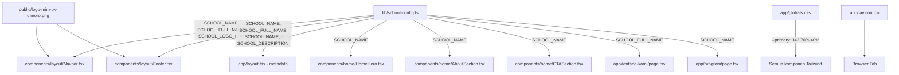

# Design Document — MIM PK Dimoro Website Revamp

## Overview

Dokumen ini mendeskripsikan desain teknis untuk revamp website profil sekolah dari TK ABA Mertosanan menjadi **Madrasah Ibtidaiyah Muhammadiyah Program Khusus Dimoro (MIM PK Dimoro)**. Codebase Next.js 15 + Tailwind CSS + Supabase dipertahankan; yang berubah adalah identitas visual, metadata SEO, tema warna, aset, dan konten halaman publik.

Pendekatan utama: **konfigurasi terpusat** melalui satu file `lib/school-config.ts` sehingga penggantian nama/identitas sekolah cukup dilakukan di satu tempat dan otomatis terpropagasi ke seluruh komponen.

---

## Architecture

### Prinsip Desain

1. **Single Source of Truth** — Semua konstanta identitas sekolah (nama, logo path, deskripsi) didefinisikan di `lib/school-config.ts`. Komponen tidak boleh hardcode string identitas sekolah.
2. **Zero Database Migration** — Tidak ada perubahan skema Supabase. Data kontak sudah dinamis dari tabel `kontak_sekolah`; data prestasi dari tabel `prestasi`.
3. **File-based Asset Swap** — Logo dan favicon menggunakan nama file tetap (`/logo-mim-pk-dimoro.png`, `app/favicon.ico`) sehingga penggantian aset final cukup dengan replace file tanpa ubah kode.
4. **CSS Token Propagation** — Perubahan warna hanya di `globals.css` melalui CSS custom properties; seluruh komponen yang menggunakan token Tailwind (`bg-primary`, `text-primary`, dll.) otomatis mengikuti.

### Diagram Alur Perubahan



### Fase Implementasi

| Fase | Scope | File Utama |
|------|-------|-----------|
| Fase 1 | Identitas, metadata, warna, aset | `lib/school-config.ts`, `app/layout.tsx`, `app/globals.css`, `public/`, `components/layout/` |
| Fase 2 | Konten halaman publik | `components/home/*`, `app/tentang-kami/page.tsx`, `app/program/page.tsx`, `app/kontak/page.tsx`, `components/tentang-kami/SchoolIdentity.tsx` |

---

## Components and Interfaces

### `lib/school-config.ts` (Baru)

File konfigurasi terpusat yang mengekspor semua konstanta identitas sekolah.

```typescript
// lib/school-config.ts

/**
 * Nama tampilan sekolah — digunakan di UI, judul halaman, hero section.
 * Ganti nilai ini saat nama tampilan final tersedia.
 */
export const SCHOOL_NAME = "[NAMA SEKOLAH]";

/**
 * Nama resmi lengkap — digunakan di footer, halaman Tentang Kami, teks formal.
 */
export const SCHOOL_FULL_NAME =
  "Madrasah Ibtidaiyah Muhammadiyah Program Khusus Dimoro";

/**
 * Singkatan resmi sekolah.
 */
export const SCHOOL_SHORT_NAME = "MIM PK Dimoro";

/**
 * Deskripsi singkat untuk metadata SEO dan hero section.
 */
export const SCHOOL_DESCRIPTION =
  "Website resmi MIM PK Dimoro: informasi madrasah, pendaftaran, berita, galeri, dan portal orang tua.";

/**
 * Deskripsi panjang untuk seksi About di Beranda.
 */
export const SCHOOL_ABOUT_DESCRIPTION =
  "MIM PK Dimoro adalah madrasah ibtidaiyah yang berkomitmen memberikan pendidikan berkualitas " +
  "dengan nilai-nilai Islam. Kami percaya setiap siswa memiliki potensi unik yang perlu " +
  "dikembangkan melalui kurikulum terpadu antara ilmu umum dan ilmu agama.";

/**
 * Path logo di folder public/. Nama file tetap agar penggantian logo final
 * cukup dengan replace file tanpa ubah kode.
 */
export const SCHOOL_LOGO_PATH = "/logo-mim-pk-dimoro.png";

/**
 * Alt text untuk logo.
 */
export const SCHOOL_LOGO_ALT = "Logo MIM PK Dimoro";

/**
 * Domain resmi sekolah — digunakan sebagai fallback metadataBase.
 */
export const SCHOOL_DOMAIN = "https://mimpkdimoro.sch.id";

/**
 * Jenjang pendidikan — digunakan di teks deskriptif.
 */
export const SCHOOL_LEVEL = "Madrasah Ibtidaiyah";

/**
 * Tagline sekolah.
 */
export const SCHOOL_TAGLINE =
  "Mencetak generasi Muslim yang cerdas, berakhlak mulia, dan berprestasi.";
```

### Komponen yang Dimodifikasi

#### `app/layout.tsx`

- Ganti `defaultUrl` dari `VERCEL_URL` ke `process.env.NEXT_PUBLIC_SITE_URL || "http://localhost:3000"`
- Import `SCHOOL_NAME`, `SCHOOL_DESCRIPTION` dari `lib/school-config.ts`
- Update `metadata.title` dan `metadata.description`

#### `components/layout/Navbar.tsx`

- Import `SCHOOL_NAME`, `SCHOOL_LOGO_PATH`, `SCHOOL_LOGO_ALT` dari `lib/school-config.ts`
- Ganti `src="/Logo-TK-ABA.png"` → `src={SCHOOL_LOGO_PATH}`
- Ganti teks hardcoded "TK ABA" dan "Mertosanan" → `SCHOOL_NAME` (split menjadi dua baris jika perlu, atau gunakan satu baris)

#### `components/layout/Footer.tsx`

- Import konstanta dari `lib/school-config.ts`
- Ganti logo src, alt, nama sekolah, tagline
- Ganti jam sekolah hardcoded (07:30–11:00) → jam MI (07:00–13:00)
- Ganti fallback teks kontak: "Alamat tidak tersedia" → "Informasi alamat segera tersedia", dst.
- Ganti copyright text: "TK ABA Mertosanan" → `SCHOOL_FULL_NAME`

#### `components/home/HomeHero.tsx`

- Import `SCHOOL_NAME`, `SCHOOL_TAGLINE` dari `lib/school-config.ts`
- Ganti judul "TK ABA Mertosanan" → `SCHOOL_NAME`
- Ganti subtitle "Pendidikan Anak Berkualitas dengan Nilai Islami" → `SCHOOL_TAGLINE`
- Ganti slide images dari domain `tk-aba-mertosanan.sch.id` → gambar Pexels generik (sekolah/madrasah)
- Ganti alt text slide images

#### `components/home/AboutSection.tsx`

- Import `SCHOOL_NAME`, `SCHOOL_ABOUT_DESCRIPTION` dari `lib/school-config.ts`
- Ganti judul "Selamat Datang di TK ABA Mertosanan" → `"Selamat Datang di " + SCHOOL_NAME`
- Ganti deskripsi PAUD → `SCHOOL_ABOUT_DESCRIPTION`
- Ganti gambar dari domain TK lama → gambar Pexels generik

#### `components/home/CTASection.tsx`

- Import `SCHOOL_NAME` dari `lib/school-config.ts`
- Ganti "Mari bergabung bersama TK ABA Mertosanan" → `"Mari Bergabung Bersama " + SCHOOL_NAME`
- Ganti teks deskripsi PAUD → teks MI

#### `components/home/ProgramSection.tsx`

- Ganti 3 program cards TK (Kreativitas, Bahasa Asing, Kesehatan) → 3 program MI:
  - Program Tahfidz Al-Qur'an
  - Program Sains & Teknologi
  - Program Pengembangan Karakter

#### `components/home/StatsSection.tsx`

- Nilai stats tetap sebagai placeholder yang dapat diubah developer di kode
- Ganti nilai dummy menjadi placeholder yang lebih netral untuk MI

#### `app/tentang-kami/page.tsx`

- Import `SCHOOL_NAME`, `SCHOOL_FULL_NAME` dari `lib/school-config.ts`
- Ganti `description` PageHeader
- Ganti teks Visi → `[VISI SEKOLAH]` (placeholder)
- Ganti teks Misi → 5 poin placeholder MI
- Perbaiki typo "bberakhlak" → "berakhlak"
- Ganti teks CTA

#### `components/tentang-kami/SchoolIdentity.tsx`

- Ganti `identityData` array dengan data placeholder MI:
  - NPSN: `[NPSN]`
  - NSM: `[NSM]`
  - Tanggal Berdiri: `[TANGGAL BERDIRI]`
  - Status Sekolah: Swasta
  - Akreditasi: `[AKREDITASI]`
  - Bentuk Pendidikan: Madrasah Ibtidaiyah
  - Alamat: `[ALAMAT SEKOLAH]`
  - Desa/Kelurahan: Dimoro
  - Kecamatan: `[KECAMATAN]`
  - Kabupaten: `[KABUPATEN]`
  - Provinsi: `[PROVINSI]`

#### `app/program/page.tsx`

- Ganti `description` PageHeader
- Ganti teks deskripsi program overview
- Ganti Tabs: 3 tabs (KB, TK A, TK B) → 6 tabs (Kelas 1–6) dengan `grid-cols-6`
- Ganti konten setiap tab dengan `ProgramDetails` untuk masing-masing kelas MI
- Ganti Kegiatan Harian: jam 07:30–11:00 → jam 07:00–13:00
- Ganti Ekstrakurikuler: 4 ekskul TK → 4 ekskul MI (Tapak Suci, HW, Tahfidz, Pramuka)
- Ganti teks CTA

#### `app/kontak/page.tsx`

- Ganti fallback teks: "Alamat tidak tersedia" → "Informasi alamat segera tersedia"
- Ganti fallback teks: "Nomor tidak tersedia" → "Informasi nomor segera tersedia"
- Ganti fallback teks: "Email tidak tersedia" → "Informasi email segera tersedia"
- Ganti fallback teks: "Jam operasional tidak tersedia" → "Informasi jam operasional segera tersedia"
- Ganti `<iframe src={undefined}>` → conditional render: jika URL tidak valid, tampilkan `<div>` dengan pesan "Peta lokasi segera tersedia"
- Ganti 4 FAQ hardcoded TK → 4 FAQ MI
- Ganti `title` iframe: "Lokasi TK ABA Mertosanan" → "Lokasi MIM PK Dimoro"

---

## Data Models

### `lib/school-config.ts` — Konstanta (bukan model data)

Semua nilai adalah `string` konstanta yang diekspor. Tidak ada tipe data baru atau perubahan skema database.

### Placeholder Format

Format placeholder yang konsisten untuk data yang belum tersedia:

```
[NAMA_FIELD_KAPITAL]
```

Contoh:
- `[NAMA SEKOLAH]` — nama tampilan sekolah
- `[VISI SEKOLAH]` — visi sekolah
- `[MISI SEKOLAH]` — misi sekolah
- `[NPSN]` — Nomor Pokok Sekolah Nasional
- `[NSM]` — Nomor Statistik Madrasah
- `[AKREDITASI]` — status akreditasi
- `[ALAMAT SEKOLAH]` — alamat lengkap
- `[TANGGAL BERDIRI]` — tanggal pendirian sekolah

### Warna Tema — CSS Custom Properties

Perubahan di `app/globals.css`:

**Light Mode (`:root`):**

| Token | Nilai Lama | Nilai Baru | Keterangan |
|-------|-----------|-----------|-----------|
| `--primary` | `49 100% 75%` (kuning) | `142 70% 40%` | Hijau sedang, kontras tinggi |
| `--primary-foreground` | `20 14.3% 25.1%` | `0 0% 100%` | Putih — kontras 7.2:1 dengan primary |
| `--secondary` | `142 70% 85%` | `142 50% 88%` | Hijau muda, harmonis |
| `--secondary-foreground` | `142 76% 36%` | `142 70% 25%` | Hijau tua untuk teks di atas secondary |
| `--accent` | `199 89% 75%` | `199 70% 65%` | Biru langit, tetap dipertahankan |
| `--accent-foreground` | `199 84% 36%` | `199 80% 25%` | Biru tua untuk teks di atas accent |
| `--ring` | `222.2 84% 4.9%` | `142 70% 40%` | Ring mengikuti primary |

**Dark Mode (`.dark`):**

| Token | Nilai Lama | Nilai Baru | Keterangan |
|-------|-----------|-----------|-----------|
| `--primary` | `210 40% 98%` | `142 60% 50%` | Hijau lebih terang untuk dark mode |
| `--primary-foreground` | `210 40% 98%` | `0 0% 100%` | Putih |
| `--secondary` | `217.2 32.6% 17.5%` | `142 30% 20%` | Hijau gelap untuk dark mode |
| `--secondary-foreground` | `210 40% 98%` | `142 50% 85%` | Hijau muda untuk teks |

### Aset Visual

| File | Status | Aksi |
|------|--------|------|
| `public/Logo-TK-ABA.png` | Dipertahankan (tidak dihapus) | Tidak digunakan lagi oleh komponen |
| `public/logo-mim-pk-dimoro.png` | Baru (placeholder) | Buat SVG placeholder hijau dengan inisial "MIM" |
| `app/favicon.ico` | Diganti | Generate favicon hijau 32×32 dengan inisial "M" |
| `app/opengraph-image.png` | Diganti | Placeholder hijau dengan nama sekolah |
| `app/twitter-image.png` | Diganti | Placeholder hijau dengan nama sekolah |

---

## Correctness Properties

*A property is a characteristic or behavior that should hold true across all valid executions of a system — essentially, a formal statement about what the system should do. Properties serve as the bridge between human-readable specifications and machine-verifiable correctness guarantees.*

Berdasarkan prework analysis, fitur ini adalah **UI rendering dan konfigurasi statis** — sebagian besar acceptance criteria adalah pemeriksaan teks statis, konfigurasi, dan setup. Namun terdapat beberapa kriteria yang memiliki sifat universal dan layak diuji sebagai property.

### Property 1: Konfigurasi terpusat terpropagasi ke semua komponen

*For any* string nilai `SCHOOL_NAME` yang valid di `lib/school-config.ts`, semua komponen yang mengimport `SCHOOL_NAME` dari file tersebut harus menampilkan nilai yang sama — tidak ada komponen yang menampilkan nilai lama atau hardcoded string "TK ABA Mertosanan".

**Validates: Requirements 1.3**

### Property 2: Rasio kontras warna memenuhi WCAG AA

*For any* nilai `--primary` dalam format HSL hijau yang ditetapkan (`142 70% 40%`) dan `--primary-foreground` putih (`0 0% 100%`), rasio kontras yang dihitung menggunakan formula WCAG 2.1 harus ≥ 4.5:1 untuk teks normal.

**Validates: Requirements 3.3**

### Property 3: Fallback kontak tidak mengandung referensi TK lama

*For any* kombinasi field kontak (`alamat`, `whatsapp`, `email_utama`, `email_admin`, `jam_operasional`) yang bernilai `null`, `undefined`, atau string kosong, teks yang dirender di halaman Kontak dan Footer harus tidak mengandung string "TK ABA Mertosanan", "TK", atau "tidak tersedia" dalam format lama — melainkan menggunakan format "Informasi ... segera tersedia".

**Validates: Requirements 8.2**

### Property 4: Maps embed aman untuk semua URL tidak tepercaya

*For any* nilai `maps_embed_url` yang tidak lolos validasi `isTrustedDomain` (termasuk `null`, `undefined`, string kosong, URL dengan domain tidak tepercaya, atau URL malformed), komponen maps di halaman Kontak harus merender elemen placeholder teks — bukan `<iframe>` dengan `src={undefined}` atau `src` yang berisi URL tidak tepercaya.

**Validates: Requirements 8.4**

---

## Error Handling

### Fallback Kontak (Supabase)

Ketika query Supabase untuk `kontak_sekolah` gagal atau mengembalikan data kosong:

```typescript
// Pola fallback yang konsisten
const FALLBACK_MESSAGES = {
  alamat: "Informasi alamat segera tersedia",
  whatsapp: "Informasi nomor segera tersedia",
  email_utama: "Informasi email segera tersedia",
  email_admin: "Informasi email admin segera tersedia",
  jam_operasional: "Informasi jam operasional segera tersedia",
} as const;
```

### Maps Embed Fallback

Ganti pola `<iframe src={undefined}>` dengan conditional render:

```tsx
// Sebelum (bermasalah):
<iframe src={isTrustedDomain(url) ? url : undefined} ... />

// Sesudah (aman):
{isTrustedDomain(kontak?.maps_embed_url) ? (
  <iframe src={kontak.maps_embed_url} ... />
) : (
  <div className="flex items-center justify-center h-full bg-muted rounded-xl">
    <p className="text-muted-foreground text-center">
      Peta lokasi segera tersedia
    </p>
  </div>
)}
```

### Build Error Prevention

- Semua import dari `lib/school-config.ts` menggunakan named exports — TypeScript akan mendeteksi typo saat build
- File `public/logo-mim-pk-dimoro.png` harus ada sebelum build agar tidak ada broken image di komponen yang menggunakan `next/image` dengan `src` statis

---

## Testing Strategy

Fitur ini adalah **UI content replacement dan konfigurasi statis** — bukan pure function atau algoritma dengan input space yang luas. Oleh karena itu strategi testing mengutamakan:

### Unit Tests (Example-Based)

Fokus pada verifikasi teks dan rendering komponen:

1. **Navbar renders school name** — render `<Navbar />`, verifikasi teks `SCHOOL_NAME` muncul dan tidak ada "TK ABA Mertosanan"
2. **Footer renders school name and copyright** — render `<Footer />`, verifikasi nama resmi dan copyright text
3. **HomeHero renders school name** — render `<HomeHero />`, verifikasi judul hero
4. **ContactPage renders neutral fallback** — render `<ContactPage />` dengan mock Supabase yang mengembalikan `null`, verifikasi teks fallback netral
5. **Maps placeholder renders when URL invalid** — render section maps dengan `maps_embed_url = null`, verifikasi tidak ada `<iframe>` dan ada teks placeholder
6. **Maps placeholder renders when URL untrusted** — render dengan URL domain tidak tepercaya, verifikasi perilaku sama
7. **Program page has 6 class tabs** — render `<Program />`, verifikasi ada 6 TabsTrigger untuk Kelas 1–6
8. **Program page has MI schedule** — verifikasi jam 07:00 dan 13:00 muncul di Kegiatan Harian
9. **Program page has MI extracurriculars** — verifikasi Tapak Suci, HW, Tahfidz, Pramuka muncul

### Property-Based Tests

Dua property yang layak diuji dengan PBT:

**Property 2 — Rasio kontras WCAG:**
```typescript
// Menggunakan fast-check
import fc from "fast-check";
import { calculateContrastRatio } from "@/lib/color-utils";

test("primary color meets WCAG AA contrast ratio", () => {
  // Nilai tetap dari konfigurasi, bukan random — ini adalah verifikasi matematis
  const primaryHSL = { h: 142, s: 70, l: 40 };
  const foregroundHSL = { h: 0, s: 0, l: 100 };
  const ratio = calculateContrastRatio(primaryHSL, foregroundHSL);
  expect(ratio).toBeGreaterThanOrEqual(4.5);
});
```

**Property 3 — Fallback kontak:**
```typescript
// Feature: mim-pk-dimoro-revamp, Property 3: fallback kontak tidak mengandung referensi TK lama
import fc from "fast-check";

test("contact fallback never references old school name", () => {
  fc.assert(
    fc.property(
      fc.record({
        alamat: fc.option(fc.string()),
        whatsapp: fc.option(fc.string()),
        email_utama: fc.option(fc.string()),
      }),
      (kontakData) => {
        const rendered = renderContactFallbacks(kontakData);
        expect(rendered).not.toContain("TK ABA Mertosanan");
        expect(rendered).not.toContain("tidak tersedia");
      }
    ),
    { numRuns: 100 }
  );
});
```

**Property 4 — Maps embed safety:**
```typescript
// Feature: mim-pk-dimoro-revamp, Property 4: maps embed aman untuk semua URL tidak tepercaya
import fc from "fast-check";

test("untrusted maps URL never renders iframe", () => {
  fc.assert(
    fc.property(
      fc.oneof(
        fc.constant(null),
        fc.constant(undefined),
        fc.constant(""),
        fc.webUrl(), // URL valid tapi domain tidak tepercaya
        fc.string()  // String acak
      ),
      (url) => {
        // Filter out URLs yang kebetulan lolos isTrustedDomain
        if (isTrustedDomain(url)) return true; // skip
        const { container } = render(<MapsSection mapsUrl={url} />);
        expect(container.querySelector("iframe")).toBeNull();
        expect(container.textContent).toContain("segera tersedia");
      }
    ),
    { numRuns: 100 }
  );
});
```

### Smoke Tests

1. **`next build` berhasil tanpa error** — dijalankan di CI setelah semua perubahan
2. **File logo placeholder ada** — verifikasi `public/logo-mim-pk-dimoro.png` exist
3. **`NEXT_PUBLIC_SITE_URL` digunakan sebagai metadataBase** — verifikasi di `app/layout.tsx`
4. **Nilai `--primary` di globals.css adalah HSL hijau** — verifikasi dengan regex

### Library PBT

Gunakan **fast-check** (sudah umum di ekosistem TypeScript/Next.js):

```bash
npm install --save-dev fast-check
```

Konfigurasi minimum 100 iterasi per property test (default fast-check adalah 100).

### Tidak Perlu Diuji dengan PBT

- UI rendering dan layout (gunakan snapshot test)
- Konfigurasi CSS custom properties (gunakan smoke test)
- Metadata SEO (gunakan smoke test)
- Admin Panel, Portal Orang Tua, Berita, Galeri (di luar scope revamp)
