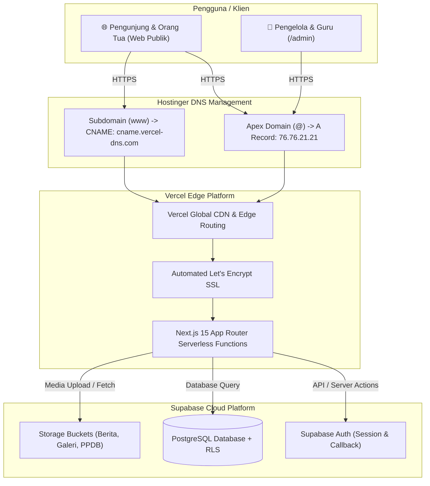

# Panduan Deployment & Konfigurasi Domain MIM PK Dimoro

Dokumentasi resmi dan Standar Operasional Prosedur (SOP) deployment sistem manajemen sekolah **MIM PK Dimoro**. Proyek ini menggunakan arsitektur modern berbasis **Next.js 15 (App Router)** yang di-deploy ke **Vercel Edge Network**, memanfaatkan **Supabase Cloud** sebagai basis data dan otentikasi, serta diarahkan ke domain resmi melalui **DNS Zone Hostinger**.

---

## 🗺️ Arsitektur Sistem Produksi



---

## 📋 Daftar Prasyarat Akses

Sebelum memulai proses deployment, pastikan Anda memiliki hak akses administratif pada layanan berikut:

| Layanan | Kebutuhan Akses | Keterangan |
| :--- | :--- | :--- |
| **GitHub** | Akses `Admin` / `Write` ke repositori `mim-pk-dimoro` | Digunakan untuk integrasi CI/CD otomatis ke Vercel |
| **Vercel** | Akun Vercel (dapat menggunakan login GitHub) | Platform hosting Next.js dan manajemen sertifikat SSL |
| **Hostinger** | Akses ke **hPanel** $\rightarrow$ Kelola Domain | Manajemen DNS Zone (A Record & CNAME) |
| **Supabase** | Akses *Owner* / *Admin* ke Dashboard Supabase Proyek | Konfigurasi API keys, Site URL, Redirect URLs, & Storage |

---

## 📚 Struktur Modul Panduan

Panduan ini disusun secara bertahap dan modular. Ikuti panduan sesuai urutan berikut:

```text
docs/deployment/
├── README.md                      # [Anda di sini] Indeks utama & arsitektur
├── 01-persiapan-dan-supabase.md   # Modul 1: Kredensial & Konfigurasi Supabase
├── 02-deployment-vercel.md        # Modul 2: Import Git, Env Vars, & Build Vercel
├── 03-konfigurasi-dns-hostinger.md # Modul 3: Konfigurasi DNS Hostinger & SSL
└── 04-verifikasi-troubleshooting.md # Modul 4: Checklist Uji Coba & Troubleshooting
```

1. 🔗 [**Modul 01: Persiapan Kredensial & Supabase Cloud**](./01-persiapan-dan-supabase.md)  
   *Panduan ekstraksi variabel environment, pengaturan Site URL Auth, whitelist Redirect URLs callback, dan perizinan bucket storage.*
2. 🔗 [**Modul 02: Setup Repository & Deployment Vercel**](./02-deployment-vercel.md)  
   *Panduan integrasi repositori GitHub ke Vercel, pengisian Environment Variables produksi, setting build Next.js, dan verifikasi deploy perdana.*
3. 🔗 [**Modul 03: Konfigurasi DNS Hostinger & Custom Domain**](./03-konfigurasi-dns-hostinger.md)  
   *Panduan menghubungkan custom domain sekolah via Hostinger hPanel DNS Zone Editor (A Record & CNAME) serta penerbitan otomatis SSL.*
4. 🔗 [**Modul 04: Verifikasi Pasca-Deploy & Troubleshooting**](./04-verifikasi-troubleshooting.md)  
   *Panduan checklist pengujian fungsional fitur sekolah, verifikasi otentikasi admin, dan pemecahan masalah kendala umum.*

---

## ⚡ Lembar Ringkas Konfigurasi Cepat (Cheat Sheet)

Bagi pengembang yang sudah terbiasa dengan alur deployment, berikut ringkasan parameter teknis utama:

### 1. Environment Variables yang Wajib Diisi di Vercel
```env
NEXT_PUBLIC_SUPABASE_URL=https://<your-project-ref>.supabase.co
NEXT_PUBLIC_SUPABASE_ANON_KEY=eyJhbGciOi...
SUPABASE_SERVICE_ROLE_KEY=eyJhbGciOi...
```

### 2. Konfigurasi DNS Hostinger
| Tipe | Nama (Host) | Nilai / Points To | TTL |
| :--- | :--- | :--- | :--- |
| **A** | `@` | `76.76.21.21` | `300` detik (atau `14400`) |
| **CNAME** | `www` | `cname.vercel-dns.com` | `300` detik (atau `14400`) |

### 3. Supabase Auth Configuration (Dashboard)
- **Site URL**: `https://<domain-sekolah>` (contoh: `https://mimpkdimoro.sch.id`)
- **Redirect URLs**:
  - `https://<domain-sekolah>/auth/callback`
  - `https://www.<domain-sekolah>/auth/callback`
  - `http://localhost:3000/auth/callback`

---

## 📌 Checklist Pelacakan Progres Deployment

Gunakan tabel ini untuk memantau status pengerjaan deployment:

- [ ] **Fase 1**: Kredensial Supabase diambil & Auth Site URL disesuaikan.
- [ ] **Fase 2**: Storage Bucket publik terverifikasi dan skema database siap.
- [ ] **Fase 3**: Repository GitHub branch utama terhubung ke Vercel.
- [ ] **Fase 4**: Environment variables terkonfigurasi di dashboard Vercel.
- [ ] **Fase 5**: Build pertama Vercel selesai dengan status *Ready* (`*.vercel.app`).
- [ ] **Fase 6**: Custom domain didaftarkan di pengaturan Vercel.
- [ ] **Fase 7**: DNS Zone Hostinger diperbarui (Record A & CNAME) dan record lama yang konflik dihapus.
- [ ] **Fase 8**: Sertifikat SSL Vercel aktif (centang hijau) & HTTPS valid.
- [ ] **Fase 9**: Login Admin, upload file media, dan form PPDB teruji sukses di domain produksi.
