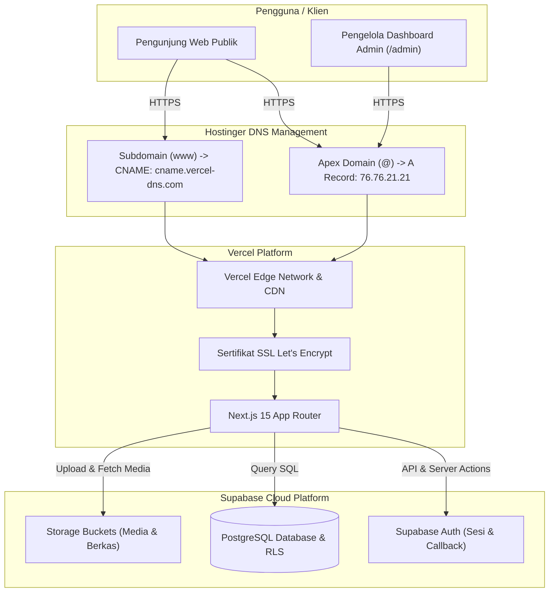

# Panduan Deployment dan Konfigurasi Domain MIM PK Dimoro

Dokumentasi teknis dan Standar Operasional Prosedur (SOP) deployment sistem manajemen sekolah MIM PK Dimoro. Proyek ini dibangun di atas Next.js 15 (App Router), di-deploy ke Vercel, menggunakan Supabase Cloud untuk basis data, otentikasi, dan storage, serta dihubungkan ke domain resmi melalui DNS Zone Hostinger.

---

## Arsitektur Sistem Produksi



---

## Prasyarat Akses Layanan

Pastikan hak akses administratif pada layanan berikut telah tersedia sebelum memulai deployment:

| Layanan | Hak Akses | Kebutuhan |
| :--- | :--- | :--- |
| GitHub | Admin / Write | Integrasi repository ke Vercel untuk pipeline CI/CD |
| Vercel | Admin Proyek | Konfigurasi build, environment variables, dan domain |
| Hostinger | Akses hPanel | Pengelolaan DNS Records (A dan CNAME) pada domain resmi |
| Supabase | Owner / Admin | Pengambilan API keys, konfigurasi Auth URL, dan Storage RLS |

---

## Struktur Modul Panduan

Dokumentasi dibagi menjadi empat modul terpisah:

```text
docs/deployment/
├── README.md                      # Indeks utama dan ringkasan arsitektur
├── 01-persiapan-dan-supabase.md   # Modul 1: Kredensial dan konfigurasi Supabase
├── 02-deployment-vercel.md        # Modul 2: Setup repository, environment variables, dan build Vercel
├── 03-konfigurasi-dns-hostinger.md # Modul 3: Konfigurasi DNS Hostinger dan aktivasi SSL
└── 04-verifikasi-troubleshooting.md # Modul 4: Validasi fungsional dan penanganan kendala
```

1. [Modul 01: Persiapan Kredensial dan Supabase Cloud](./01-persiapan-dan-supabase.md)  
   Pengambilan variabel lingkungan, pengaturan Site URL, konfigurasi Redirect URLs auth, dan hak akses bucket storage.
2. [Modul 02: Setup Repository dan Deployment Vercel](./02-deployment-vercel.md)  
   Impor repository GitHub, pengisian Environment Variables di Vercel, build settings, dan pengujian deployment awal.
3. [Modul 03: Konfigurasi DNS Hostinger dan Custom Domain](./03-konfigurasi-dns-hostinger.md)  
   Pemetaan A Record dan CNAME di DNS Zone Hostinger, pembersihan record lama yang bentrok, dan verifikasi domain di Vercel.
4. [Modul 04: Verifikasi Pasca-Deploy dan Troubleshooting](./04-verifikasi-troubleshooting.md)  
   Daftar uji fungsional fitur utama dan solusi teknis untuk kesalahan umum.

---

## Parameter Teknis Cepat

### 1. Environment Variables untuk Vercel
```env
NEXT_PUBLIC_SUPABASE_URL=https://<project-ref>.supabase.co
NEXT_PUBLIC_SUPABASE_ANON_KEY=eyJhbGciOi...
SUPABASE_SERVICE_ROLE_KEY=eyJhbGciOi...
```

### 2. DNS Records Hostinger
| Tipe | Nama (Host) | Target / Points To | TTL Rekomendasi |
| :--- | :--- | :--- | :--- |
| A | `@` | `76.76.21.21` | 300 detik (atau 14400) |
| CNAME | `www` | `cname.vercel-dns.com` | 300 detik (atau 14400) |

### 3. URL Supabase Auth
- Site URL: `https://<domain-resmi>`
- Additional Redirect URLs:
  - `https://<domain-resmi>/auth/callback`
  - `https://www.<domain-resmi>/auth/callback`
  - `http://localhost:3000/auth/callback`

---

## Checklist Progres Deployment

- [ ] Fase 1: Kredensial Supabase dicatat dan Auth Site URL disesuaikan.
- [ ] Fase 2: Bucket storage publik dan skema tabel database terverifikasi.
- [ ] Fase 3: Repository GitHub terhubung ke proyek Vercel.
- [ ] Fase 4: Tiga Environment Variables terpasang di Vercel.
- [ ] Fase 5: Build pertama di Vercel selesai dengan status Ready.
- [ ] Fase 6: Custom domain ditambahkan pada pengaturan Vercel.
- [ ] Fase 7: DNS Records di Hostinger diperbarui dan record lama yang bentrok dihapus.
- [ ] Fase 8: Propagasi DNS selesai dan sertifikat SSL aktif di Vercel.
- [ ] Fase 9: Pengujian login admin, pengunggahan file, dan formulir PPDB berhasil.
