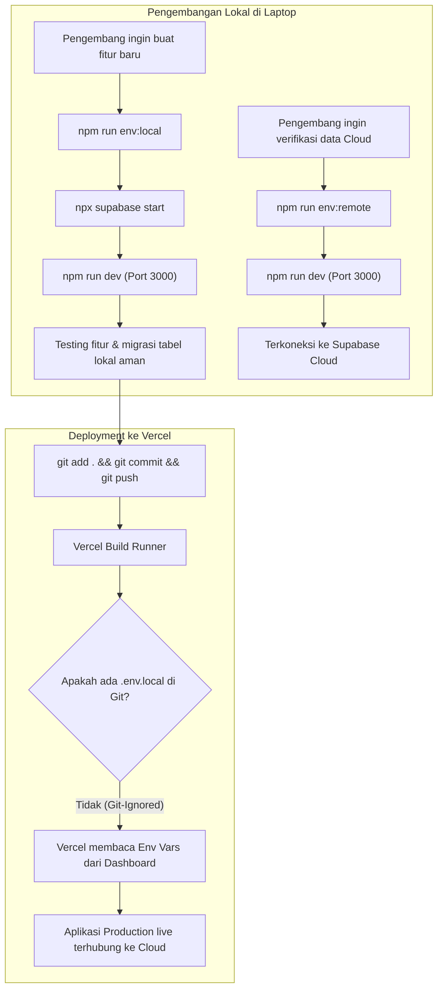

# Spesifikasi Desain: Switch Antara Supabase Local & Remote (Deployment)

## 1. Ringkasan Eksekutif
Dokumen ini mendefinisikan arsitektur dan alur kerja untuk mempermudah peralihan lingkungan (*environment switching*) antara instance Supabase Lokal (Docker / Supabase CLI) dan Supabase Remote (Supabase Cloud) pada proyek MIM PK Dimoro (Next.js 15 App Router).

Tujuan utama sistem ini:
1. Memberikan isolasi penuh bagi pengembang saat menambahkan fitur baru tanpa risiko merusak data produksi di cloud.
2. Memungkinkan pengujian data produksi secara cepat di laptop pengembang bila diperlukan.
3. Menjamin proses deployment ke Vercel tetap otomatis, zero-configuration, dan zero-risk (file lokal tidak pernah bocor ke Vercel atau Git).

---

## 2. Arsitektur & Struktur File

### 2.1 File Environment
Pengelolaan variabel lingkungan dibagi menjadi file-file profil yang terisolasi:

| Nama File | Status Git | Peruntukan / Konten |
| :--- | :--- | :--- |
| `.env.local.supabase-local` | Git-Ignored | Kredensial lokal Docker (`http://127.0.0.1:54321`, local anon key, local service role key). |
| `.env.local.supabase-remote` | Git-Ignored | Kredensial Supabase Cloud (`https://<project-ref>.supabase.co`, remote anon key, remote service role key). |
| `.env.local` | Git-Ignored | File aktif yang dibaca oleh Next.js 15, merupakan hasil salinan (*copy*) dari salah satu file profil di atas. |
| `.env.example` | Committed | Panduan referensi publik berisi instruksi konfigurasi lokal vs remote. |

### 2.2 Aturan Keamanan `.gitignore`
Memastikan pattern berikut aktif di `.gitignore`:
```gitignore
# Environment files & profiles
.env*.local
.env
```
Pola `.env*.local` memastikan file `.env.local`, `.env.local.supabase-local`, dan `.env.local.supabase-remote` tidak akan pernah terlacak oleh Git.

---

## 3. Komponen Script Switcher: `scripts/switch-env.mjs`

### 3.1 Spesifikasi Script
Script Node.js berbasis ES Module (`.mjs`) tanpa dependensi eksternal (*zero-dependency*) yang mendukung lingkungan Windows (PowerShell/CMD), macOS, dan Linux.

### 3.2 Alur Logika Eksekusi
1. **Argumen CLI**:
   * `local`: Mengaktifkan konfigurasi Supabase lokal.
   * `remote`: Mengaktifkan konfigurasi Supabase remote/cloud.
   * `status`: Menampilkan profil dan URL Supabase yang sedang aktif di `.env.local`.
2. **Penanganan Jika File Belum Ada**:
   * Jika `.env.local.supabase-local` belum ada, script akan menginisialisasinya secara otomatis dengan URL default Supabase CLI (`http://127.0.0.1:54321`) dan default local JWT keys.
   * Jika `.env.local.supabase-remote` belum ada:
     * Script memeriksa apakah `.env.local` atau `.env` saat ini memiliki URL cloud. Jika ya, menyalinnya sebagai profil awal remote.
     * Jika tidak, membuat template `.env.local.supabase-remote` dengan placeholder terarah.
3. **Penyalinan File**:
   * Menyalin file sumber ke `.env.local` secara atomik menggunakan `fs.copyFileSync`.
4. **Output Terminal & Feedback**:
   * Menampilkan pesan status berwarna dan informatif.
   * Menampilkan nilai `NEXT_PUBLIC_SUPABASE_URL` yang aktif.
   * Mengingatkan pengembang untuk me-restart dev server (`npm run dev`) jika sedang berjalan.

---

## 4. Integrasi NPM Scripts di `package.json`

Penambahan script pada blok `scripts` di `package.json`:
```json
"scripts": {
  "env:local": "node scripts/switch-env.mjs local",
  "env:remote": "node scripts/switch-env.mjs remote",
  "env:status": "node scripts/switch-env.mjs status"
}
```

---

## 5. Alur Kerja Pengembang (Workflow)



### 5.1 Pengembangan Fitur Baru
1. Jalankan `npm run env:local`.
2. (Jika menggunakan CLI) Jalankan `npx supabase start`.
3. Jalankan `npm run dev`.
4. Seluruh mutasi data (PPDB, Berita, Storage, Auth) terisolasi di database lokal.

### 5.2 Pengujian Data Cloud di Lokal
1. Jalankan `npm run env:remote`.
2. Jalankan `npm run dev`.

### 5.3 Deployment ke Vercel
1. Tidak memerlukan langkah peralihan manual apapun di lokal.
2. Cukup jalankan `git push`.
3. Vercel secara otomatis menggunakan environment variable produksi yang telah didaftarkan pada Vercel Project Settings.

### 5.4 Sinkronisasi Skema Database
1. Migrasi lokal dibuat di `supabase/migrations/`.
2. Migrasi diterapkan ke Supabase Cloud menggunakan perintah `npx supabase db push`.

---

## 6. Dokumentasi & Panduan
Menyusun modul panduan pengembang di `docs/deployment/05-switching-local-remote.md` dan memperbarui `docs/deployment/README.md`.

---

## 7. Rencana Verifikasi
1. **Pengujian Script Switcher**:
   * Uji coba `npm run env:local` &rarr; verifikasi isi `.env.local` berisi endpoint `127.0.0.1:54321`.
   * Uji coba `npm run env:remote` &rarr; verifikasi isi `.env.local` berisi endpoint Supabase Cloud.
   * Uji coba `npm run env:status` &rarr; verifikasi deteksi environment aktif akurat.
2. **Pengujian Git Security**:
   * Jalankan `git status` untuk memastikan `.env.local.supabase-local` dan `.env.local.supabase-remote` tidak muncul sebagai untracked files.
3. **Pengujian Build & Lint**:
   * Jalankan `npm run lint` dan `npm run test` untuk memastikan integritas kode tetap terjaga 100%.
